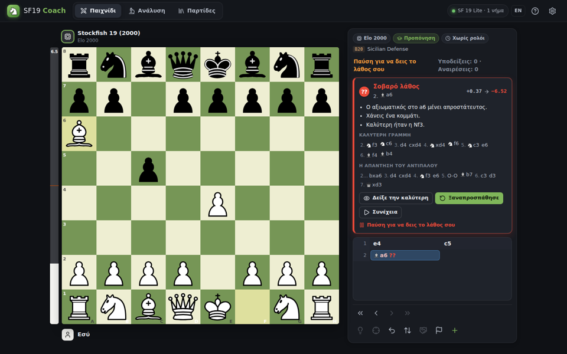
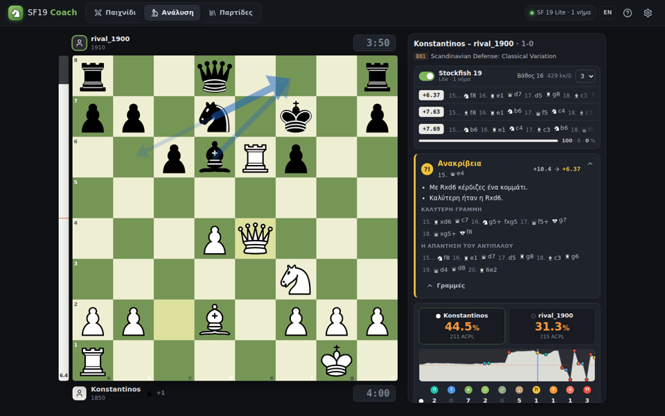

# SF19 Coach — προπονητής σκακιού με το Stockfish 19

Παίξε με το **Stockfish 19** στο επίπεδό σου, πάρε σχόλια σε κάθε κίνηση, ανάλυσε τις παρτίδες σου και λύσε τα δικά σου λάθη σαν ασκήσεις.
Όλα τρέχουν **μέσα στον browser** (WebAssembly) — δεν χρειάζεται server, και μετά την πρώτη φόρτωση δουλεύει και offline.



## Τι κάνει

- **Παιχνίδι με το Stockfish 19** — δύναμη από Elo 1320 έως 3190 ή πλήρης δύναμη, με ή χωρίς ρολόι, λευκά/μαύρα/τυχαία, από την αρχική θέση ή από δικό σου FEN.
- **Προπονητής σε κάθε κίνηση** (λειτουργία «Προπόνηση»): Καλύτερη / Εξαιρετική / Καλή / Θεωρία / Ανακρίβεια / Λάθος / Σοβαρό λάθος / Χαμένη ευκαιρία / Σπουδαία / Εκπληκτική, με εξήγηση
  («ο ίππος στο f3 μένει απροστάτευτος», «επιτρέπει ματ σε 3», «με Rxd6 κέρδιζες ένα κομμάτι»), την καλύτερη γραμμή και την απάντηση του αντιπάλου.
  Σταματά όταν κάνεις λάθος ώστε να το δεις και να **ξαναπροσπαθήσεις**.
- **Υποδείξεις** (3 επίπεδα), **«Τι απειλεί;»**, **αναιρέσεις**, ειδοποίηση όταν ο αντίπαλος κάνει λάθος, **premoves**, προαγωγή πιονιού.
- **Ανάλυση παρτίδας**: ακρίβεια % ανά παίκτη (ίδιος τύπος με το lichess), ACPL, γράφημα αξιολόγησης, μετρητές λαθών ανά κατηγορία.
- **«Εξάσκηση στα λάθη μου»**: κάθε λάθος σου γίνεται άσκηση — βρες την καλύτερη κίνηση.
- **Πίνακας ανάλυσης**: έως 5 γραμμές μηχανής, βέλη, νίκη/ισοπαλία/ήττα %, βαριάντες, απειλή, επεξεργαστής θέσης, ονόματα ανοιγμάτων (ECO).
- **Εισαγωγή/εξαγωγή PGN** (π.χ. παρτίδες από lichess/chess.com, με ρολόγια) — η εξαγωγή περιέχει αξιολογήσεις και σύμβολα `?!`, `?`, `??`.
- **Οι παρτίδες μου**: αρχείο με στατιστικά (σκορ, μέση ακρίβεια, σοβαρά λάθη/παρτίδα, εξέλιξη).
- Ελληνικά / English, σκούρο/ανοιχτό θέμα, 6 χρώματα σκακιέρας, ήχοι, συντομεύσεις πληκτρολογίου, λειτουργεί και σε κινητό (μπορεί να «εγκατασταθεί» ως εφαρμογή).



## Ανέβασμα στο Render (δωρεάν) — βήμα-βήμα

1. **GitHub**: φτιάξε νέο repository (π.χ. `sf19-coach`) στο <https://github.com/new>.
   Στη σελίδα του repo πάτα **«uploading an existing file»** και σύρε **όλα τα αρχεία και τους φακέλους** αυτού του project (όχι τον εξωτερικό φάκελο) → **Commit changes**.
2. **Render**: στο <https://dashboard.render.com> πάτα **New → Blueprint**, σύνδεσε το GitHub σου και διάλεξε το repo.
   Το Render διαβάζει το `render.yaml` και φτιάχνει μόνο του ένα δωρεάν **Static Site** με τις σωστές ρυθμίσεις. Πάτα **Apply / Deploy**.
3. Σε ~2–3 λεπτά είναι έτοιμο στο `https://sf19-coach.onrender.com` (ή παρόμοιο όνομα). Αυτό είναι το link σου.

> Εναλλακτικά: **New → Static Site** → Build Command `npm ci && npm run build`, Publish Directory `dist`.
> (Τότε οι headers COOP/COEP μπαίνουν αυτόματα από τον service worker της εφαρμογής, οπότε η πολυνηματική μηχανή δουλεύει κι έτσι.)

Κάθε φορά που αλλάζεις κάτι στο GitHub, το Render ξαναχτίζει και ανεβάζει τη νέα έκδοση αυτόματα.

## Τρέξιμο τοπικά

Χρειάζεται [Node.js](https://nodejs.org) 20+:

```bash
npm ci
npm start          # build + server στο http://localhost:8080
```

## Πώς δουλεύει

- **Μηχανή**: [stockfish.js](https://github.com/nmrugg/stockfish.js) 19.0.0 — το επίσημο Stockfish 19 (5/9/2026) μεταγλωττισμένο σε WebAssembly. Κατά το build κατεβαίνει από το npm, οπότε το repo μένει μικρό.
  - *Πλήρης* έκδοση (NNUE ~94 MB, η δυνατότερη) ή *Lite* (~1,6 MB). Αλλάζει από τις Ρυθμίσεις.
  - Αν ο browser το επιτρέπει (COOP/COEP), τρέχει **πολυνηματικά** (ρύθμιση «Νήματα CPU»). Αλλιώς πέφτει αυτόματα σε 1 νήμα.
  - Κατεβαίνει **μία φορά** και μένει στην cache — μετά ανοίγει αμέσως, και offline.
- **Χαρακτηρισμοί κινήσεων**: βασίζονται στην πτώση της πιθανότητας νίκης (μοντέλο lichess): ανακρίβεια ≥5%, λάθος ≥10%, σοβαρό λάθος ≥15%, συν τους κανόνες του lichess για ματ.
  «Σπουδαία» = η μόνη καλή κίνηση, «Εκπληκτική» = σωστή θυσία υλικού.
- Όλα τα δεδομένα (ρυθμίσεις, παρτίδες) μένουν **στη συσκευή σου** (localStorage/IndexedDB).

## Συντομεύσεις

`← →` κινήσεις · `Home/End` αρχή/τέλος · `↑ ↓` βαριάντες · `F` περιστροφή · `H` υπόδειξη · `T` απειλή · `U` αναίρεση · `Space` μηχανή on/off (ανάλυση) · `X` απειλή (ανάλυση) · `N` νέα παρτίδα

## Δομή

```
src/js/engine/      UCI wrapper, επιλογή build, φόρτωση/progress, fallbacks
src/js/analysis/    χαρακτηρισμός κινήσεων, ακρίβεια, εξηγήσεις, ανάλυση παρτίδας
src/js/controllers/ λογική παιχνιδιού (play.js) και ανάλυσης (analysis.js)
src/js/ui/          περιβάλλον (Preact)
src/sw.js           service worker (offline, COOP/COEP, σωστό MIME για .wasm)
scripts/build.mjs   build (esbuild) + αντιγραφή Stockfish στο dist/
render.yaml         ρυθμίσεις Render (Blueprint)
```

Tests: `npm test` (τρέχει το πραγματικό Stockfish 19 σε Node).

---

## English (short)

**SF19 Coach** is a Stockfish 19 chess trainer that runs entirely in the browser: play at any strength (Elo 1320–3190 or full strength),
get move-by-move coaching with explanations, full game review with lichess-style accuracy, “learn from your mistakes” drills, analysis board, PGN import/export and a game library.

Deploy on Render: push this folder to a GitHub repo → Render **New → Blueprint** → select the repo (uses `render.yaml`). Local: `npm ci && npm start`.

## Άδειες / Licenses

GPL-3.0-or-later (βλ. `LICENSE`). Χρησιμοποιεί:
[Stockfish](https://stockfishchess.org) 19 (GPLv3) μέσω [stockfish.js](https://github.com/nmrugg/stockfish.js) (GPLv3),
[chessground](https://github.com/lichess-org/chessground) & [chessops](https://github.com/niklasf/chessops) (lichess, GPLv3, κομμάτια cburnett),
[lichess chess-openings](https://github.com/lichess-org/chess-openings) (CC0), [Preact](https://preactjs.com) (MIT), [Lucide](https://lucide.dev) εικονίδια (ISC).
